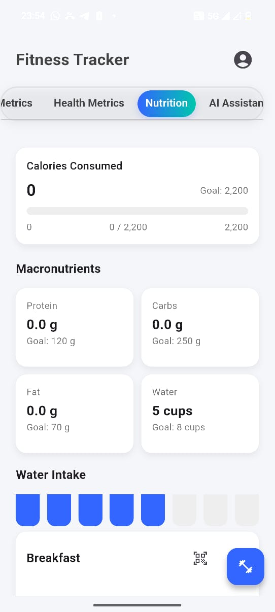
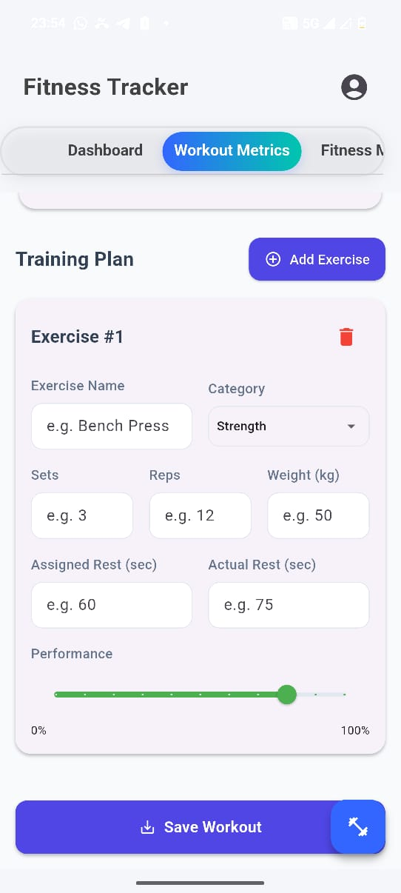
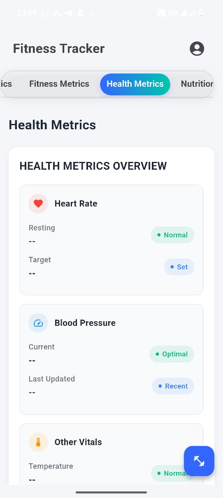
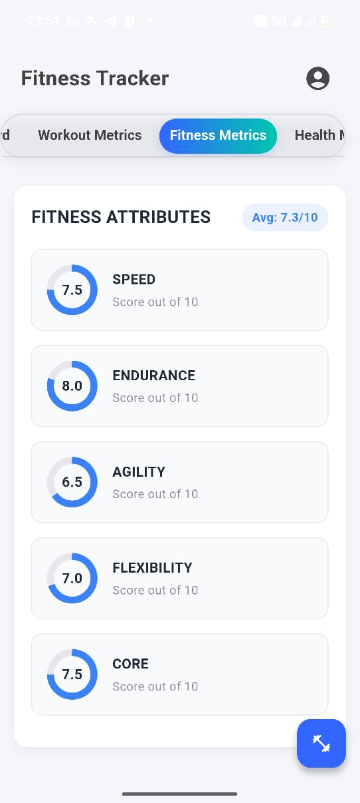
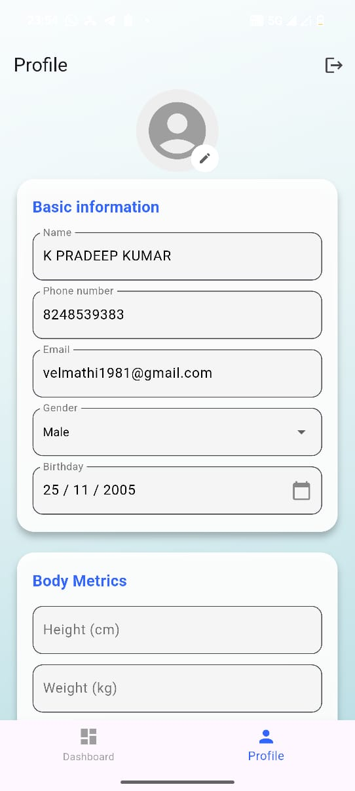

<div align="center">

# 🏃‍♂️ AthleteIQ
### AI-Powered Athletic Performance and Wellness Intelligence Platform


*Transforming fragmented athlete data into actionable performance intelligence.*

</div>

---

## 📋 Table of Contents

- [Problem Statement](#-problem-statement)
- [Proposed Solution](#-proposed-solution)
- [Key Features](#-key-features)
- [AI Insight Engine](#-ai-insight-engine)
- [Tech Stack](#-tech-stack)
- [UI/UX Screenshots](#-uiux-screenshots)
- [Innovation](#-innovation)
- [Future Scope](#-future-scope)
- [Impact](#-impact)
- [Getting Started](#-getting-started)

---

## 🎯 Problem Statement

Athletes and fitness enthusiasts generate large amounts of data daily, including workout performance, body measurements, health indicators, sleep quality, nutrition intake, and sports-specific metrics. However, most existing fitness applications only display raw data through charts and dashboards, leaving users without meaningful insights into their performance, recovery, and overall wellness.

As a result, athletes often struggle to understand how factors such as sleep, nutrition, training intensity, and physiological health affect their performance and long-term progress.

## 💡 Proposed Solution

**AthleteIQ** is an AI-powered athletic intelligence platform designed to transform fragmented athlete data into actionable performance insights. The platform collects and analyzes data related to body metrics, workout sessions, fitness activities, health indicators, sleep quality, and nutrition habits to provide personalized athlete intelligence.

The system uses machine learning models to predict:

- 🏆 Athletic Performance Score
- ⚡ Training Readiness Score
- 🔄 Recovery Status
- ⚠️ Injury Risk Level
- 🥗 Nutrition Adequacy Score

Based on these predictions, AthleteIQ generates personalized insights that help athletes improve performance, optimize recovery, and make informed training decisions.

## ✨ Key Features

### 👤 Athlete Profile Management
- Personal information management
- Body measurement tracking
- Historical progress monitoring

### 🏋️ Workout Analytics
- Exercise logging
- Sets, reps, and weight tracking
- Training volume analysis
- Rest period monitoring
- Workout performance evaluation

### 🤸 Fitness Assessment
- Sports-specific activity tracking
- Distance and time analysis
- Speed assessment
- Endurance evaluation
- Agility and flexibility scoring

### ❤️ Health Monitoring
- Heart rate tracking
- Blood pressure monitoring
- Blood oxygen level tracking
- Blood sugar recording
- Body temperature monitoring
- Sleep duration and quality analysis

### 🍎 Nutrition Intelligence
- Meal tracking
- Calorie monitoring
- Protein, carbohydrate, and fat analysis
- Water intake monitoring
- Daily nutrition assessment

## 🧠 AI Insight Engine

The platform combines outputs from multiple machine learning models to generate meaningful athlete insights and recommendations.

**Example Output:**

```
Performance Score : 82/100
Readiness Score    : 76/100
Injury Risk        : Low
Nutrition Score    : 68/100
```

> *"Your performance has improved by 8% compared to last week. Recovery indicators remain stable and injury risk is low. Increasing daily protein intake may further enhance muscle recovery and athletic performance."*

## 🛠 Tech Stack

| Layer | Technology |
|---|---|
| **Frontend** | Flutter |
| **Backend** | Firebase, Cloud Firestore |
| **Machine Learning** | Python, TensorFlow, Scikit-Learn, LightGBM |
| **Database** | Firebase Firestore |
| **Deployment** | Mobile Application, Cloud-Based Infrastructure |

## 📱 UI/UX Screenshots

> Save your screenshots into a `screenshots/` folder at the repo root using the filenames below — they'll render automatically here on GitHub once pushed.

<table>
<tr>
<td align="center"><br><b>Onboarding</b></td>
<td align="center"><br><b>Authentication</b></td>
<td align="center"><br><b>Nutrition Tab</b></td>
</tr>
<tr>
<td align="center"><br><b>Workout Metrics</b></td>
<td align="center"><br><b>Health Metrics</b></td>
  <td align="center"><br><b>Fitness Metrics</b></td>
</tr>
<tr>
<td align="center"><br><b>Profile Screen</b></td>
<td></td>
<td></td>
</tr>
</table>

## 🚀 Innovation

Unlike traditional fitness applications that only track data, AthleteIQ leverages artificial intelligence to analyze athlete behavior patterns and generate predictive insights. The platform integrates workout performance, health metrics, nutrition habits, and fitness assessments into a unified intelligence system capable of supporting data-driven athletic development.

## 🔮 Future Scope

- Wearable Device Integration
- Smartwatch Synchronization
- Advanced Performance Forecasting
- Team and Coach Analytics Dashboard
- Transformer-Based Performance Prediction Models
- Real-Time Athlete Monitoring
- Personalized Training Plan Optimization

## 🌍 Impact

AthleteIQ empowers athletes, coaches, and fitness enthusiasts by converting raw health and performance data into actionable intelligence. The platform aims to improve training efficiency, reduce injury risk, optimize recovery, and enhance long-term athletic performance through AI-driven decision support.

## ⚙️ Getting Started

**Clone the repository**
```bash
git clone https://github.com/KpradeepKumar25/AthleteIQ-AI-Powered-Athletic-Performance-and-Wellness-Intelligence-Platform.git
cd AthleteIQ-AI-Powered-Athletic-Performance-and-Wellness-Intelligence-Platform
```

**Set up the Flutter frontend**
```bash
flutter pub get
flutter run
```

**Set up the Python backend**
```bash
cd backend
python -m venv venv
venv\Scripts\activate        # Windows
pip install -r requirements.txt
```

---

<div align="center">

Built by **Pradeep Kumar** · [GitHub](https://github.com/KpradeepKumar25)

</div>
